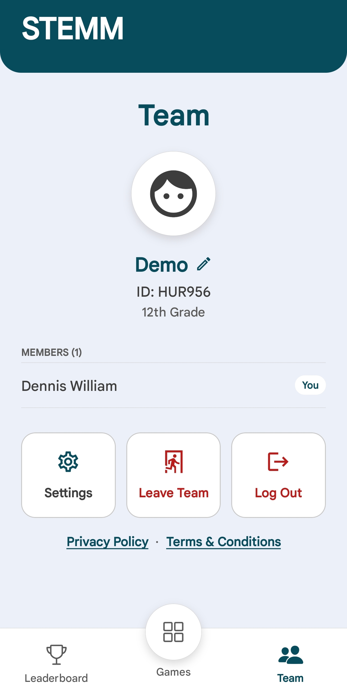
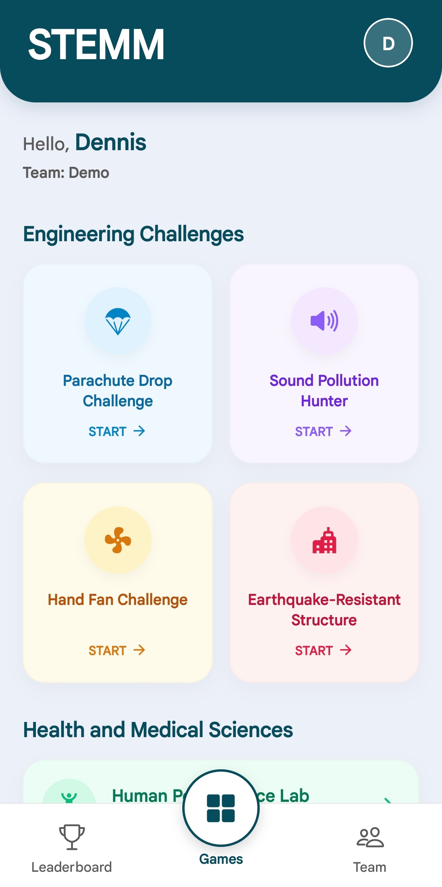
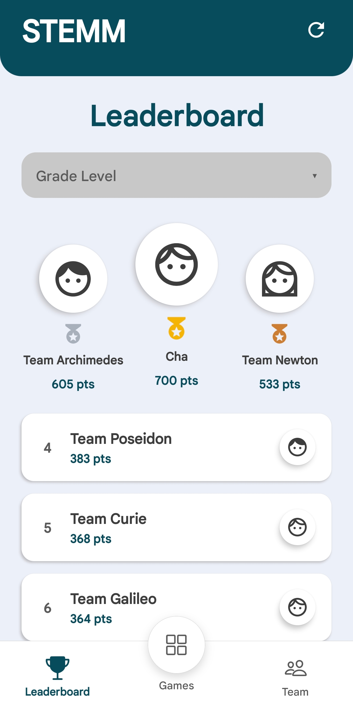

# STEMM

STEMM is a mobile app for running hands-on science and engineering challenges with student teams. Students sign in, join or create a team, and work through guided activities that walk them from a hypothesis to a real measurement and a written reflection. Completing an activity awards points that feed a shared, cross-team leaderboard.

The app is built with Expo (React Native) and uses Firebase for accounts, team data, and the leaderboard, plus a local SQLite database for recording each activity session on the device.

<p align="center">
  
  
  
</p>

<p align="center"><em>Build a team, work through guided activities, and climb the leaderboard.</em></p>

## What it does

- **Accounts** — Email and password sign-up and login through Firebase Auth, with email verification and a forgot-password flow. New users get a profile document in Firestore.
- **Teams** — Create a team or join an existing one with a short invite code. Each team has a name and grade level, and the leaderboard ranks teams by their total score.
- **Activities** — Each activity is a five-step wizard: Instructions, Prediction, Recorder, Write-Up, and Discussion. The Recorder step uses real device hardware where it makes sense (microphone, camera/photo library, vibration). Finishing an activity awards points to the team once, guarded against duplicates.
- **Leaderboard** — Team scores are stored in Firestore and ranked live, with a background task that periodically refreshes leaderboard data.
- **Activity map** — An interactive map (native and web variants) for locating and discovering challenges, using device location.
- **Notifications** — Local reminders to finish an activity, plus push-notification registration on supported builds.
- **Other** — Light/dark theming, haptics, animations and transitions, in-app ads via Google Mobile Ads, and Firebase Analytics event tracking.

### Activities

Engineering challenges:

- Parachute Drop Challenge
- Sound Pollution Hunter (real microphone decibel meter)
- Hand Fan Challenge (real video picker)
- Earthquake-Resistant Structure (continuous device vibration)

Health and medical sciences:

- Human Performance Lab
- Reaction Board Challenge
- Breathing Pace Trainer

## Tech stack

- **Framework** — Expo (SDK 54) and React Native, with file-based routing via Expo Router
- **Language** — TypeScript
- **Backend** — Firebase (Auth, Firestore, Analytics)
- **Local storage** — SQLite via `expo-sqlite`
- **UI / motion** — React Native Reanimated, Gesture Handler, Expo Haptics
- **Device APIs** — `expo-audio`, `expo-image-picker`, `expo-location`, `expo-sensors`, `expo-notifications`, `expo-background-fetch`, `expo-task-manager`
- **Maps** — `react-native-maps`
- **Ads** — `react-native-google-mobile-ads`
- **Testing** — Jest with `jest-expo` and React Native Testing Library

## Project structure

```
app/                 Screens and routes (Expo Router)
  (auth)/            Login, register, forgot password, create/join team
  (main)/            Dashboard, leaderboard, team
  (tabs)/            Tab-based screens
  parachute.tsx ...  One file per activity wizard
  map.tsx            Interactive activity map (with map.web.tsx for web)
components/          Shared UI (auth shell, progress bar, ad banner, nav, etc.)
constants/           Theme and motion constants
hooks/               Color scheme and theme hooks
lib/                 Firebase, SQLite (db + crud), points, notifications,
                     background tasks, discriminant codes, error helpers
scripts/             reset-project and leaderboard seeding
__tests__/           Unit, integration, and e2e tests
assets/              Icons and images
```

## Getting started

### Prerequisites

- Node.js and npm
- A Firebase project (Auth and Firestore enabled)
- Expo Go on a device, or an Android/iOS emulator. Push notifications and ads require a development build rather than Expo Go.

### Setup

1. Install dependencies:

   ```bash
   npm install
   ```

2. Create a `.env` file from the example and fill in your Firebase config:

   ```bash
   cp .env.example .env
   ```

   ```
   EXPO_PUBLIC_FIREBASE_API_KEY=
   EXPO_PUBLIC_FIREBASE_AUTH_DOMAIN=
   EXPO_PUBLIC_FIREBASE_PROJECT_ID=
   EXPO_PUBLIC_FIREBASE_STORAGE_BUCKET=
   EXPO_PUBLIC_FIREBASE_MESSAGING_SENDER_ID=
   EXPO_PUBLIC_FIREBASE_APP_ID=
   EXPO_PUBLIC_FIREBASE_MEASUREMENT_ID=
   ```

3. Start the app:

   ```bash
   npx expo start
   ```

   From there you can open the app in a development build, an Android emulator, an iOS simulator, or Expo Go.

### Building

Builds are produced in the cloud with [EAS Build](https://docs.expo.dev/build/introduction/). The profiles are defined in `eas.json`:

- **development** — Internal dev client (Android APK / iOS simulator) on the `development` channel.
- **preview** — Internal-distribution build (Android APK) on the `preview` channel, for sharing test builds via an install link or QR code.
- **production** — Store-ready build with auto-incremented version on the `production` channel.

Authenticate once with `eas login`, then run:

```bash
# Preview build (installable APK, shareable link)
eas build --profile preview --platform android

# Development client
eas build --profile development --platform android

# Production
eas build --profile production --platform all
```

Use `--platform ios` or `--platform all` to target iOS. If EAS CLI isn't installed globally, prefix commands with `npx eas-cli`. Version numbers are managed remotely (`appVersionSource: "remote"`), so EAS handles versioning automatically.

## Scripts

- `npm start` — Start the Expo dev server
- `npm run android` — Start and open on Android
- `npm run ios` — Start and open on iOS
- `npm run web` — Start in the browser
- `npm run lint` — Run the linter
- `npm test` — Run the test suite
- `npm run test:coverage` — Run tests with coverage
- `npm run seed` — Seed leaderboard data (reads `.env`)
- `npm run seed:clear` — Clear seeded leaderboard data

## Data model

Firestore holds the authoritative shared data: `users`, `teams`, and `point_awards` (which prevents the same activity from scoring twice for a team). The local SQLite database mirrors a parallel schema for on-device session capture: teams, team members, activities, challenge sessions, challenge data points, and leaderboard scores. The schema is created and seeded through a versioned migration in `lib/db.ts`.

## Testing

Tests live under `__tests__/` and cover unit logic (points, CRUD, notifications, background tasks, discriminant codes), integration (Firebase, theme, errors), and an end-to-end app-config check. Run them with:

```bash
npm test
```
